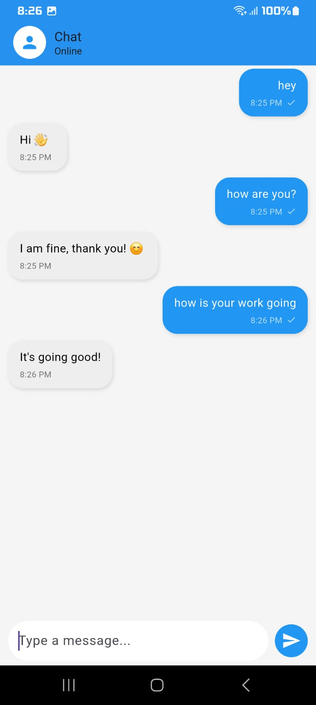
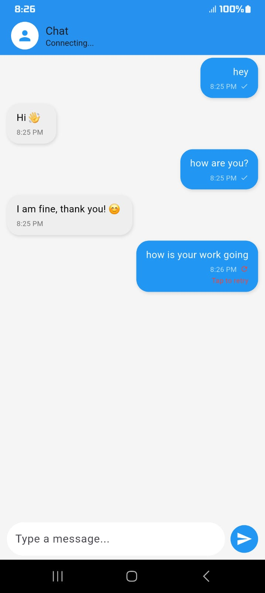

# Real-Time Chat App (Flutter + WebSocket)

## 🚀 Features

* Real-time messaging using WebSocket connection
* MVVM architecture with Provider for clean state management
* Multi-user chat simulation with sender-based message handling
* Smart reply system based on user input
* Message delivery states (Sending, Sent, Failed)
* Retry mechanism for failed messages
* Auto-reconnection handling for network interruptions
* Modern chat UI with message alignment, timestamps, and status indicators

## 🛠️ Tech Stack

* Flutter
* WebSocket (`web_socket_channel`)
* Provider (State Management)

## 📱 Demo
### Chat UI

### Retry Feature

(Add screenshots or GIF here)

## 🔥 Key Highlights

* Implemented real-time communication using WebSocket
* Designed fault-tolerant messaging with retry mechanism
* Simulated multi-user chat flow without backend
* Handled network failures with auto-reconnection logic
* Built scalable architecture using MVVM

## 📌 Future Improvements

* Real backend (Node.js / Firebase)
* Typing indicator
* Local storage (Hive) for message persistence

## 🧠 Description

Developed a real-time chat application using Flutter and WebSocket, 
implementing MVVM architecture for scalable and maintainable code. 
The app includes multi-user simulation, smart replies, connection handling, retry mechanisms, 
and a modern chat interface with message states and timestamps.
